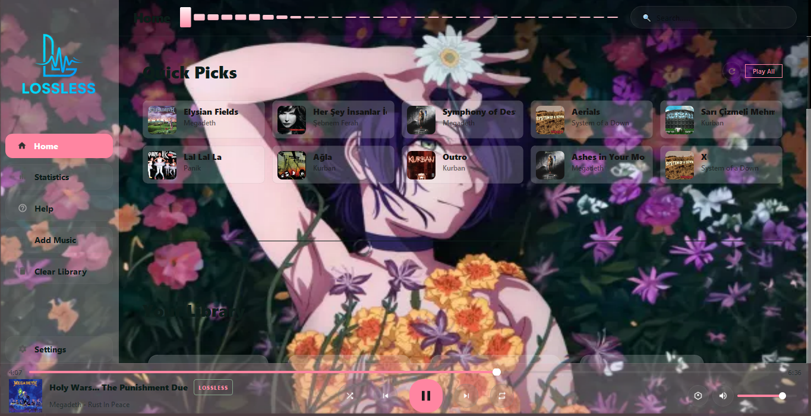
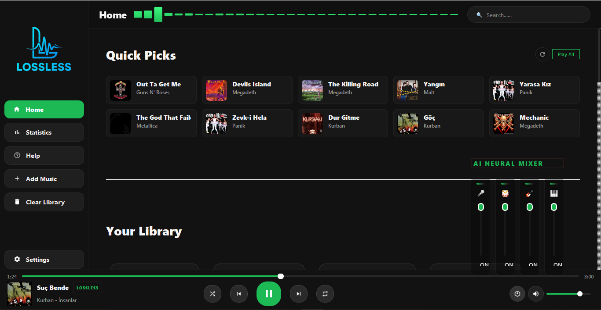
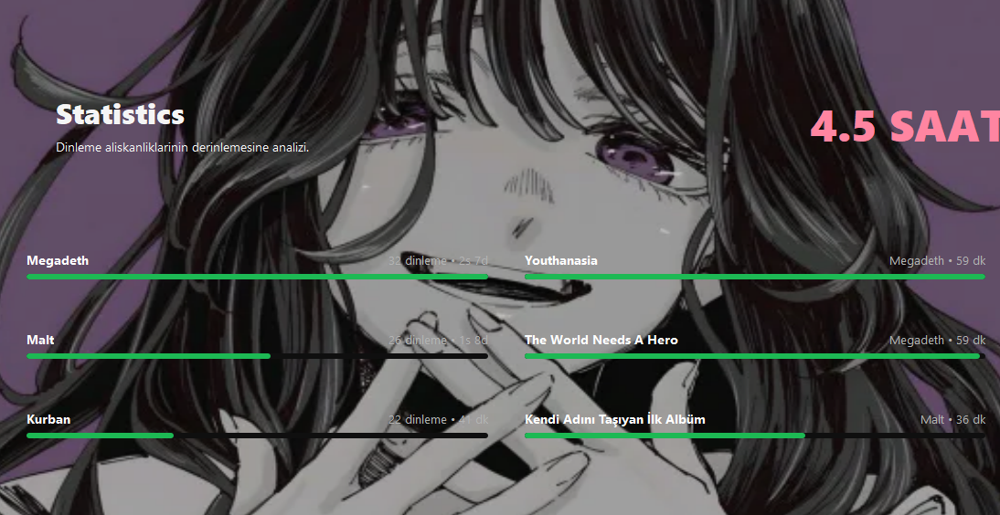

# 🎧 A-Bir Player - Local AI Music Workstation


**A-Bir Player**, Kendi kütüphanenizi kayıpsız bir şekilde internete bağımlı olmadan dinlemenizi sağlayan AI destekli, özelleştirilebilir arayüze sahip bir müzik çalar uygulamasıdır.


Başlamadan önemli not: Bu uygulama henüz geliştirme aşamasında olan bir uygulamadır. Bazı kusurları vardır ve ilerde düzenlenecektir. Eğer dilerseniz kaynak kodlarını kendi bilgisayarınıza indirip düzenleyebilirsiniz. İsterseniz de sadece release olarak indirip kullanabilirsiniz. 

Başlamadan önemli not 2: Henüz yeni bir uygulama olduğu için muhtemelen bir çok sorunla kaşılaşacaksınız. Çözemediğiniz sorunlar için discord üzerinden bana ulaşabilirsiniz. Buyrun nickim, maincomputer12sq

**Uygulama internetten veri çekmez, kendi lokal kütüphanenizi kullanır. Yani müzik oynatmak için müzik eklemeniz gereklidir :)**
---

##  Öne Çıkan Özellikler

### Gelişmiş AI Stem Separation
*   İçerisindeki Demucs AI modeli ile şarkılar farklı kanallara(stemlere) ayırılabilir. (Davul, Bass, Vokal, Diğer)
*   Veriler buluta gönderilmeden lokalde çalışan bir AI modeli ile işlendiği için kullanılan cihazın gücü önemlidir. NVIDIA GPU içeren bir bilgisayar ile kullanmak önerilir. Sadece CPU ile de bu özellik çalıştırılabiliyor fakat daha uzun sürer.
*   Şarkıyı ayırma süresi donanımın gücüne bağlıdır. Sadece CPU olan sistemlerde CPU ile gücüne bağlı olarak şarkı süresinin 1-10 katı değişiklik gösterebilir. Örnek göstermek için kendi bilgisayarımdaki i3 5005U işlemci ile ortalama şarkı süresinin 5 katı kadar sürdü. 
*   Şarkılar tekli veya albüm halinde ayrıştırılabilir.

### Tasarım ve Kişiselleştirme
*   Farklı hazır tema şablonları kullanılabilir.  -- ÖNEMLİ NOT: Bazı temalar okunaklı olmayabilir. Merak etmeyin, bunlar zamanla düzeltilecek.
*   Cam Modu açılabilir ya da özel opaklık oranları ile kişiselleştirilebilir.
*   Var olan temalar hoşunuza gitmiyor ise her bir parçanın rengi manuel olarak ayırılabilir.
*   İstenilen görsel arka plan olarak eklenilebilir(16:9 önerilir).

### İstatistik Saklama
*   Hangi sanatçıyı, hangi albümü, hangi şarkıyı kaç saat dinlediğiniz lokal veri tabanında kaydedilir. 
*   Windows medya kontrolleri ile tam uyumludur. Klavye ve kulaklıklardaki çoğu medya tuşu çalışır.
*   Şuan içerisinde Last.fm Scrobbling bağlantısı var gibi görünse de maalesef bu özellik bozuk. İlerde düzeltilecek.

###  Teknik Yetenekler
*   .flac , .mp3 , .wav ve diğer pek çok ses formatını destekler ve hepsini kayıpsız şekilde orijinal kalitede donanımınızın ses kartına gönderir.
*   Çok dil desteği bazı noktalarda eksik olabileceği gibi İngilizce ve Türkçe desteği vardır.
*   Şarkılarınızda var olan metadatayı okuyup etiketlendirir. Eğer eklediğiniz müziklerin içerisinde yeterli metadata yoksa şarkı görünmeyebilir veya "unknown" isimli albümün içerisinde görünebilir.

---



---


##  Kurulum

* **Eğer release sürümünü indirecekseniz sadece release dosyasını indirmeniz yeterli.**
---


### Geliştirici İçin Kurulum ve Gereksinimler

1. **[Python 3.10+](https://www.python.org/)**
2. **FFmpeg:**
    * *[FFmpeg sitesinden](https://www.gyan.dev/ffmpeg/builds/):* [essentials](https://www.gyan.dev/ffmpeg/builds/ffmpeg-git-essentials.7z) veya [**full**](https://www.gyan.dev/ffmpeg/builds/ffmpeg-git-full.7z)sürümünü indirebilirsiniz.

### Adım Adım Kurulum

1.  **Projeyi Klonlayın:**
    ```bash
    git clone https://github.com/2mmartie/A-Bir-Player.git && cd A-Bir-Player
    ```

2.  **Bağımlılıkları Yükleyin:**
    ```bash
    pip install -r requirements.txt